# Enterprise Data Architecture & Entity Relationship Diagram

This document maps the causal relationships and foreign-key linkages between the Master Data (Dimensions) and Transaction Data (Facts) generated by the Digital Twin Simulator.

```mermaid
erDiagram
    %% Master Data (Dimensions)
    DIM_FACTORY {
        string Factory PK
        string Type
        string Location
    }
    DIM_PRODUCTION_LINE {
        string Production_Line PK
        string Factory FK
    }
    DIM_MACHINE {
        string Machine PK
        string Production_Line FK
        string Factory FK
        string Type
    }
    DIM_PRODUCT {
        string Product PK
        string Factory_Type
    }
    DIM_EMPLOYEE {
        string Employee PK
        string Factory FK
        string Role
    }
    DIM_SUPPLIER {
        string Supplier PK
        int Delivery_Time
    }
    DIM_CUSTOMER {
        string Customer PK
        string Type
    }
    DIM_WAREHOUSE {
        string Warehouse PK
        string Factory FK
        string Type
    }
    DIM_PART {
        string Part PK
        string Supplier FK
    }

    %% Transaction Data (Facts)
    FACT_SENSOR ||--o{ DIM_MACHINE : "monitors"
    FACT_SENSOR {
        datetime Timestamp
        string Machine FK
        float Temperature
        float Vibration
        float Power_Consumption
        string Running_Status
        string Mode
    }

    FACT_MAINTENANCE ||--o{ DIM_MACHINE : "repairs"
    FACT_MAINTENANCE ||--o{ DIM_EMPLOYEE : "performed_by (Technician)"
    FACT_MAINTENANCE {
        date Date
        string Machine FK
        string Technician FK
        string Failure
        float Cost
    }

    FACT_ERP_PRODUCTION ||--o{ DIM_PRODUCT : "manufactures"
    FACT_ERP_PRODUCTION ||--o{ DIM_EMPLOYEE : "operated_by (Operator)"
    FACT_ERP_PRODUCTION {
        string Production_Order PK
        string Product FK
        string Operator FK
        int Quantity_Produced
        int Scrap
    }

    FACT_QUALITY ||--o{ DIM_PRODUCT : "inspects"
    FACT_QUALITY ||--o{ DIM_EMPLOYEE : "inspected_by (Inspector)"
    FACT_QUALITY {
        string Inspection_ID PK
        string Product FK
        string Inspector FK
        string Defect_Type
        int Pass
        int Fail
    }

    FACT_INVENTORY ||--o{ DIM_PART : "stocks"
    FACT_INVENTORY ||--o{ DIM_WAREHOUSE : "stored_in"
    FACT_INVENTORY ||--o{ DIM_SUPPLIER : "supplied_by"
    FACT_INVENTORY {
        date Date
        string Part FK
        string Warehouse FK
        string Supplier FK
        int Stock
    }

    FACT_ENERGY ||--o{ DIM_MACHINE : "consumes"
    FACT_ENERGY {
        date Date
        string Machine FK
        float Energy
        float Cost
        float Carbon_Emission
    }

    FACT_SHIPMENTS ||--o{ FACT_ERP_PRODUCTION : "fulfills"
    FACT_SHIPMENTS ||--o{ DIM_CUSTOMER : "delivers_to"
    FACT_SHIPMENTS ||--o{ DIM_PRODUCT : "contains"
    FACT_SHIPMENTS {
        string Shipment_ID PK
        string Production_Order FK
        string Customer FK
        string Product FK
        date Dispatch_Date
        boolean Delayed
    }

    %% Core Relationships
    DIM_FACTORY ||--o{ DIM_PRODUCTION_LINE : "houses"
    DIM_FACTORY ||--o{ DIM_WAREHOUSE : "houses"
    DIM_FACTORY ||--o{ DIM_EMPLOYEE : "employs"
    DIM_PRODUCTION_LINE ||--o{ DIM_MACHINE : "contains"
    DIM_SUPPLIER ||--o{ DIM_PART : "supplies"
```

## Causal Linkage (Business Logic Flow)
1. **Machine Health (IoT)** degrades ➔
2. Triggers **Maintenance (Downtime)** ➔
3. Reduces **ERP Production Output** & Increases **Scrap** ➔
4. Causes **Quality Inspections** to Fail ➔
5. Depletes **Inventory** faster than planned ➔
6. Causes **Shipments** to be Delayed to Customers.
