# 🏭 Master Data Schema Infographic

This document provides a visual map of every CSV file generated in the project and exactly how they connect to one another. Use this as your cheat sheet when dragging files into Tableau!

## 🗺️ Visual Architecture Map

The diagram below represents the exact structure of your data. The tables in the middle are the **Fact** tables (the events that happen), and the tables on the edges are the **Dimension** (DIM) tables (the people, places, and things).

```mermaid
erDiagram
    %% Core Telemetry
    FACT_SENSOR_LIVE {
        datetime Timestamp
        string Machine FK
        string Factory FK
        string Production_Line FK
        float Temperature
        float Vibration
    }
    
    DIM_MACHINE {
        string Machine PK
        string Factory FK
        string Type
        float Power_KW
    }

    DIM_FACTORY {
        string Factory PK
        string Type
        string Location
    }
    
    DIM_PRODUCTION_LINE {
        string Production_Line PK
        string Factory FK
    }

    %% Energy & Maintenance
    FACT_ENERGY {
        date Date
        string Machine FK
        float Energy
        float Cost
    }
    
    FACT_MAINTENANCE {
        date Date
        string Machine FK
        string Technician FK
        string Failure
        float Cost
    }
    
    DIM_EMPLOYEE {
        string Employee PK
        string Department
        string Role
        string Factory
    }

    %% Production & Supply Chain
    FACT_ERP_PRODUCTION {
        string Production_Order PK
        string Product FK
        string Operator FK
        string __factory FK
        int Quantity_Produced
    }
    
    DIM_PRODUCT {
        string Product PK
        string Factory_Type
    }
    
    FACT_QUALITY {
        date Date
        string Product FK
        string Inspector FK
        string Defect_Type
        boolean Pass
    }

    FACT_SHIPMENTS {
        string Shipment_ID PK
        string Production_Order FK
        string Customer FK
        string Product FK
        int Quantity
    }
    
    DIM_CUSTOMER {
        string Customer PK
        string Type
    }

    %% Inventory
    FACT_INVENTORY {
        date Date
        string Part FK
        string Warehouse FK
        string Supplier FK
        int Stock
    }

    DIM_PART {
        string Part PK
        string Supplier FK
        float Cost
    }

    DIM_SUPPLIER {
        string Supplier PK
        string Quality_Score
    }

    DIM_WAREHOUSE {
        string Warehouse PK
        string Factory FK
        string Type
    }

    %% Draw Relationships
    FACT_SENSOR_LIVE }|--|| DIM_MACHINE : "Machine = Machine"
    FACT_SENSOR_LIVE }|--|| DIM_FACTORY : "Factory = Factory"
    FACT_SENSOR_LIVE }|--|| DIM_PRODUCTION_LINE : "Production Line = Production Line"
    
    DIM_MACHINE }|--|| DIM_FACTORY : "Factory = Factory"
    
    FACT_ENERGY }|--|| DIM_MACHINE : "Machine = Machine"
    FACT_MAINTENANCE }|--|| DIM_MACHINE : "Machine = Machine"
    FACT_MAINTENANCE }|--|| DIM_EMPLOYEE : "Technician = Employee"
    
    FACT_ERP_PRODUCTION }|--|| DIM_PRODUCT : "Product = Product"
    FACT_ERP_PRODUCTION }|--|| DIM_FACTORY : "__factory = Factory"
    FACT_ERP_PRODUCTION }|--|| DIM_EMPLOYEE : "Operator = Employee"
    
    FACT_QUALITY }|--|| DIM_PRODUCT : "Product = Product"
    FACT_QUALITY }|--|| DIM_EMPLOYEE : "Inspector = Employee"
    
    FACT_SHIPMENTS }|--|| FACT_ERP_PRODUCTION : "Production Order = Production Order"
    FACT_SHIPMENTS }|--|| DIM_CUSTOMER : "Customer = Customer"
    FACT_SHIPMENTS }|--|| DIM_PRODUCT : "Product = Product"
    
    FACT_INVENTORY }|--|| DIM_PART : "Part = Part"
    FACT_INVENTORY }|--|| DIM_WAREHOUSE : "Warehouse = Warehouse"
    FACT_INVENTORY }|--|| DIM_SUPPLIER : "Supplier = Supplier"
    
    DIM_PART }|--|| DIM_SUPPLIER : "Supplier = Supplier"
```

---

## 📑 Detailed Connection Guide

Here is the exact mapping of columns you need to link in Tableau to bring the diagram above to life:

> [!IMPORTANT]
> The **Left Column** is the file you dragged in first. The **Right Column** is the file you are attaching to it.

| Primary Table (Left) | Join Operator | Dimension Table (Right) |
| :--- | :---: | :--- |
| `fact_sensor_live.csv` (`Machine`) | **=** | `dim_machine.csv` (`Machine`) |
| `fact_sensor_live.csv` (`Factory`) | **=** | `dim_factory.csv` (`Factory`) |
| `fact_sensor_live.csv` (`Production Line`) | **=** | `dim_production_line.csv` (`Production Line`) |
| `fact_maintenance.csv` (`Machine`) | **=** | `dim_machine.csv` (`Machine`) |
| `fact_maintenance.csv` (`Technician`) | **=** | `dim_employee.csv` (`Employee`) |
| `fact_erp_production.csv` (`Product`) | **=** | `dim_product.csv` (`Product`) |
| `fact_erp_production.csv` (`Operator`) | **=** | `dim_employee.csv` (`Employee`) |
| `fact_erp_production.csv` (`__factory`) | **=** | `dim_factory.csv` (`Factory`) |
| `fact_shipments.csv` (`Production Order`) | **=** | `fact_erp_production.csv` (`Production Order`) |
| `fact_shipments.csv` (`Customer`) | **=** | `dim_customer.csv` (`Customer`) |
| `fact_inventory.csv` (`Part`) | **=** | `dim_part.csv` (`Part`) |
| `fact_inventory.csv` (`Warehouse`) | **=** | `dim_warehouse.csv` (`Warehouse`) |
| `fact_inventory.csv` (`Supplier`) | **=** | `dim_supplier.csv` (`Supplier`) |
